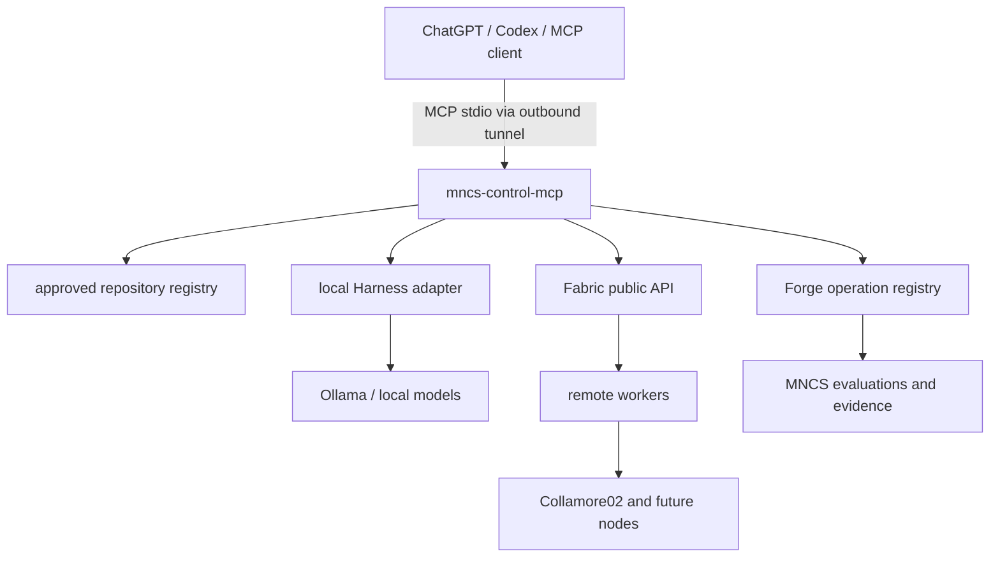

# mncs-control-mcp

`mncs-control-mcp` is a small, local-only MCP control boundary for the MNCS laboratory. It gives ChatGPT, Codex, and other MCP clients a standards-based stdio interface for bounded inspection and controlled actions while keeping the Fedora development machine private.

## Architecture



The ownership boundary is intentional: Harness remains the local agent/model executor, Fabric remains the discovery/routing/remote execution authority, Forge remains the evaluation/evidence authority, and Commons remains the shared protocol/knowledge layer. This project exposes those capabilities; it does not reimplement them.

## Installation and local run

```bash
cd ~/Documents/Projects/mncs-control-mcp
python -m venv .venv
. .venv/bin/activate
python -m pip install -e '.[dev]'
cp config/control.example.toml control.toml
# Edit projects_root and any local integration paths.
mncs-control-mcp --config control.toml
```

The server uses stdio, so normal MCP clients own the process lifecycle. `MNCS_PROJECTS_ROOT` overrides the configured projects root. No inbound HTTP listener or SSH service is started.

## MCP tools

- `system_status` — bounded host, memory, disk, GPU/NVIDIA, Ollama, Harness, Fabric, and Forge status.
- `list_repositories` — approved MNCS repository registry and existence.
- `repo_status(repository)` — safe Git metadata for an approved registry key.
- `fabric_status` — Fabric worker state through `FabricClient`.
- `model_status` — local Ollama and Fabric model inventory.
- `run_tests(repository, test_suite, component?, timeout?)` — fixed `pytest`, `cargo test`, or detected repository test action.
- `run_mncs_evaluation(repository, case_study, model?, evaluation_profile?)` — invokes a configured Forge development workflow where the current Forge interface permits it, otherwise returns a structured capability response.
- `dispatch_fabric_job(...)` — currently reports the exact missing validated-plan/bundle interface; it does not accept commands or synthesize unsafe jobs.
- `job_status(job_id)` and `job_result(job_id)` — bounded lookup for recognized control-boundary jobs.

## Security model

MCP callers are treated as untrusted. Repository inputs are registry keys, never paths. Resolved paths must remain below the configured Projects root. Subprocesses use fixed argument arrays, `shell=False`, a filtered environment, bounded timeouts, bounded output, and redaction. Git status omits sensitive filenames such as `.env` and SSH keys. There is deliberately no shell, arbitrary command, arbitrary Ollama argument, arbitrary filesystem-read, credential, or secret tool.

The server logs call receipt, selected tool, result, duration, and failure code to stderr. MCP stdout remains protocol data.

## Tests

```bash
python -m pytest
ruff check .
```

The suite covers startup and tool discovery, configuration, repository authorization and traversal attempts, Git status in a temporary repository, timeout/output limits, environment filtering, structured host status, and unavailable upstream integrations.

## Secure MCP Tunnel

The stdio server is ready to be run inside [OpenAI Secure MCP Tunnel](https://developers.openai.com/api/docs/guides/secure-mcp-tunnels). The current official OpenAI documentation uses a local stdio profile like this (keep secrets only in the runtime environment):

```bash
export CONTROL_PLANE_API_KEY="<runtime key>"

tunnel-client init \
  --sample sample_mcp_stdio_local \
  --profile mncs-fedora \
  --tunnel-id <TUNNEL_ID> \
  --mcp-command "${HOME}/Documents/Projects/mncs-control-mcp/.venv/bin/mncs-control-mcp --config ${HOME}/Documents/Projects/mncs-control-mcp/control.toml"

tunnel-client doctor --profile mncs-fedora --explain
tunnel-client run --profile mncs-fedora
```

The tunnel client makes outbound HTTPS connections; it does not require inbound internet access. Create/manage the tunnel in Platform tunnel settings, associate it with the intended Platform organization and ChatGPT workspace, and grant the required tunnel permissions. The server itself remains local and provider-neutral.

## Current limitations and future direction

Fabric dispatch is intentionally capability-gated until a safe adapter can construct validated Fabric plans, manifests, and bundles from a narrow task schema. Forge evaluation currently maps only to configured development workflows; model/profile routing is not yet a Forge operation. Harness status is configuration/library status rather than a daemon health check because Harness is not a long-lived service.

The next progression is:

```text
ChatGPT / Codex / local models / other agents
                         |
                         v
                 mncs-control-mcp
                   /       |       \
              Harness   Fabric    Forge
                   \       |       /
                    MNCS-Commons
                         |
                distributed MNCS laboratory
```

High-value next steps are a reviewed Fabric job-plan adapter, explicit Forge evaluation-profile mapping, persistent bounded job storage, and an operator authorization policy for mutating actions.
# mncs-control-mcp
